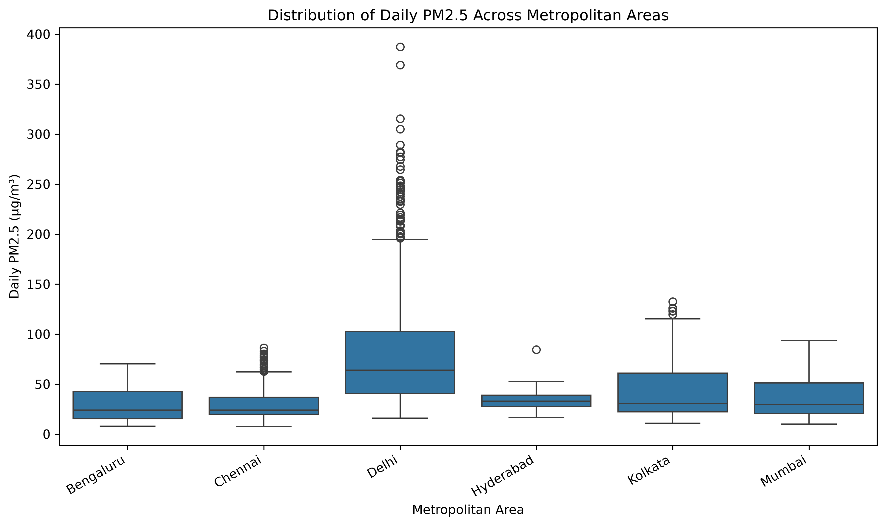
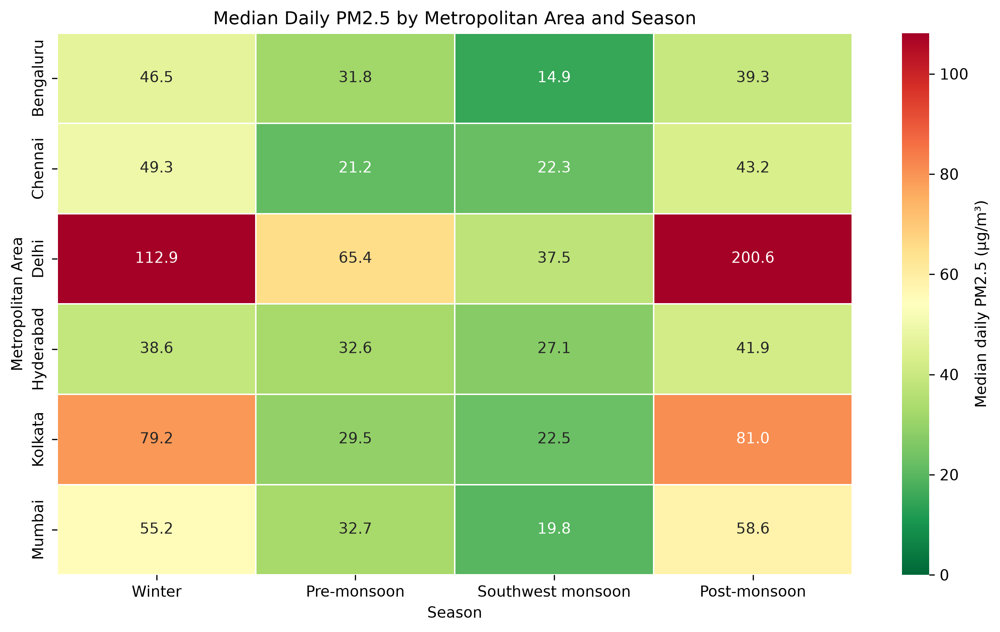

# Statistical Analysis of PM2.5 Air Pollution Across Major Indian Cities

A reproducible statistical analysis of approximately **3.48 million PM2.5 measurements** from **86 monitoring stations across six major Indian metropolitan areas**, covering March 2025 through August 2026.

The project evaluates how PM2.5 concentrations vary across cities, seasons, monitoring stations, and comparable periods in 2025 and 2026. It combines data-quality screening, descriptive statistics, visualization, nonparametric hypothesis testing, multiple-comparison correction, effect-size estimation, and sensitivity analysis.

The analysis finds pronounced and statistically significant geographic and seasonal disparities in urban PM2.5. **Delhi exhibits substantially higher and more variable concentrations than the other metropolitan areas**, while several cities show markedly lower concentrations during the Southwest monsoon. The analysis also identifies an important data-governance issue: city-level pollution estimates can be sensitive to monitoring-station composition, demonstrating why coverage and spatial representativeness matter when air-quality data are used for decision-making.

## Problem and Decision Question

Urban air-quality reporting is often reduced to a single city-level number, but that summary can hide important differences in **seasonality, day-to-day variability, within-city station patterns, and monitoring coverage**. A city may appear to have a stable pollution profile even when concentrations vary sharply across seasons or neighborhoods, and city-level estimates may change depending on which monitoring stations have sufficient data.

This project therefore asks:

> **How do PM2.5 concentrations differ across major Indian metropolitan areas, how stable are those differences across seasons and monitoring-station selections, and what does that imply for using city-level air-quality metrics in decision-making?**

From a decision perspective, the analysis is intended to support two practical questions:

- **Where and when is PM2.5 burden most concentrated?**
- **How much confidence should decision-makers place in a city-level pollution estimate when monitoring coverage and station composition vary?**

These questions shift the project from simply comparing pollution levels to evaluating whether the underlying data are reliable enough to support operational, public-health, or policy decisions.

## Dataset and Analysis Scale

The analysis uses PM2.5 measurements distributed through the **OpenAQ** platform from continuous ambient air-quality monitoring stations in six major Indian metropolitan areas:

- Bengaluru
- Chennai
- Delhi
- Hyderabad
- Kolkata
- Mumbai

The study period spans **March 1, 2025 through August 31, 2026**.

The primary analysis pipeline processed approximately **3.48 million raw PM2.5 measurements** from **86 monitoring stations**. After anomaly screening and completeness checks, the data were aggregated into **34,669 station-day observations** and then into a balanced city-day panel for cross-city statistical comparison.

Key analysis scales:

- **3,477,273** raw PM2.5 measurements
- **3,470,133** valid measurements after cleaning
- **86** monitoring stations in the primary cohort
- **71** monitoring stations in the stricter sensitivity cohort
- **34,669** station-day observations
- **375** balanced dates used for the primary six-city comparison
- **356** common dates used for aligned primary-versus-sensitivity comparison

The repository includes the compact processed datasets required to reproduce the notebook analysis, while the larger raw and intermediate archive files are excluded from version control.

## Methodology

The analysis was designed to make cross-city comparisons more reliable despite uneven monitoring coverage and highly skewed pollution distributions.

### Data Quality and Cohort Selection

Monitoring stations were evaluated for temporal coverage across the full 18-month study period.

- **Primary cohort:** stations reporting in all 18 months with at least **60% overall measurement completeness**
- **Sensitivity cohort:** stations reporting in all 18 months with at least **70% completeness**

Raw PM2.5 measurements were screened by removing negative values and measurements greater than or equal to **1,000 µg/m³**. The upper threshold was treated as a project-specific anomaly-screening rule rather than a universal regulatory validity threshold.

### Temporal Aggregation

Approximately 15-minute measurements were aggregated in two stages:

1. **Hourly PM2.5 mean:** required at least 3 valid measurements within the hour.
2. **Station-day PM2.5 mean:** required at least 18 valid hourly observations within the day.

Station-day observations were then aggregated to metropolitan-area daily values.

For primary cross-city comparisons, a city-day was retained only when at least **50% of the expected monitoring stations** for that city reported valid observations. The final inferential dataset was restricted to dates satisfying this criterion for **all six metropolitan areas**, producing a balanced panel of 375 matched dates.

### Statistical Analysis

The project combines descriptive and inferential methods:

- Mean, median, standard deviation, quartiles, interquartile range, minimum, and maximum
- Distribution and skewness analysis
- City-level boxplots
- Mean-versus-median comparison
- City-by-season heatmap
- March–August 2025 versus 2026 paired-period comparison
- **Friedman rank test** for overall cross-city differences
- **Wilcoxon signed-rank tests** for pairwise city comparisons
- **Holm correction** for multiple comparisons
- **Kendall's W** to quantify the magnitude of the overall cross-city effect

A sensitivity analysis repeated the cross-city comparison using the stricter 71-station cohort and aligned common dates to evaluate whether the conclusions were robust to monitoring-station selection.

## Key Findings

### 1. Delhi stands apart from the other metropolitan areas

Delhi had the highest median daily PM2.5 concentration in the balanced city comparison at **64.11 µg/m³** and also showed the greatest variability. Its mean concentration was substantially higher than its median, indicating strong right-skewness and the influence of high-pollution days.



### 2. Seasonal variation is large and differs by city

Seasonality was especially pronounced in Delhi, Kolkata, and Mumbai. Delhi's median PM2.5 concentration was approximately **200.62 µg/m³ during the post-monsoon period** compared with **37.47 µg/m³ during the Southwest monsoon**.



This suggests that annual city averages can hide large differences in when pollution burden is concentrated.

### 3. Cross-city differences are statistically systematic

The Friedman test found a statistically significant difference in daily PM2.5 concentrations across the six metropolitan areas:

- **χ²(5) = 767.58**
- **p < .001**
- **Kendall's W = 0.409**

All 15 pairwise Wilcoxon signed-rank comparisons remained statistically significant after Holm correction.

The effect sizes and paired differences show, however, that statistical significance alone is not sufficient for interpretation. Some city pairs differed substantially, particularly comparisons involving Delhi, while other statistically significant pairs differed by less than **1 µg/m³**.

### 4. City-level averages can hide within-city variation

Monitoring stations within the same metropolitan area sometimes showed materially different pollution profiles. Delhi had the largest range in station-level median PM2.5 concentrations, while Chennai showed substantially less station-to-station variation.

This means that a single metropolitan-area average should not automatically be interpreted as representative of every neighborhood.

### 5. Monitoring-station composition can materially affect the reported city metric

The stricter 71-station sensitivity analysis produced a similar overall cross-city effect, indicating that the main conclusion is robust.

However, **Mumbai's estimated median concentration changed by approximately 20%** when the stricter monitoring-station cohort was used.

This is an important data-product finding: a city-level air-quality KPI can change materially depending on which monitoring stations meet the inclusion criteria. Monitoring coverage, station composition, and representativeness therefore need to be treated as part of the metric definition rather than as background implementation details.

## Decision Implications

The analysis suggests that city-level air-quality metrics should not be treated as simple reporting outputs. They are decision inputs whose reliability depends on **season, monitoring coverage, and station composition**.

### Prioritize by city and season, not annual average alone

The strong seasonal differences observed across metropolitan areas mean that intervention strategies based only on annual or overall city averages can miss when pollution burden is most concentrated.

For operational or policy use, the data support a more targeted approach:

- Identify high-burden city-season combinations;
- Concentrate monitoring, alerts, enforcement, and mitigation resources during those periods;
- Avoid interpreting a single annual city average as a complete description of pollution conditions.

### Attach data-quality context to every city-level KPI

The sensitivity analysis shows that city-level estimates can change materially when the monitoring-station cohort changes.

A production air-quality analytics system should therefore expose the quality of the underlying measurement network alongside the reported PM2.5 metric.

Useful companion indicators could include:

- Number of reporting stations;
- Percentage of expected stations reporting;
- Temporal completeness;
- Station-cohort changes;
- Sensitivity of the city metric to station inclusion;
- Warnings when coverage falls below an agreed threshold.

### Treat metric definition as a governance decision

A city-level PM2.5 value is partly determined by methodological choices such as station inclusion rules, completeness thresholds, aggregation methods, and handling of missing data.

These choices should be documented and versioned rather than embedded invisibly in an analytics pipeline. Changes to the monitoring network or metric definition could otherwise appear as changes in pollution even when the underlying environmental conditions have not changed.

### Avoid overclaiming from short-term comparisons

The March–August 2025 versus 2026 analysis identified substantial city-specific differences, but the study does not establish long-term trends or causality.

Operational dashboards should clearly distinguish among:

- Current measurements;
- Short-period comparisons;
- Statistically supported long-term trends;
- Causal claims.

This distinction reduces the risk that descriptive changes are interpreted as evidence that a policy or intervention succeeded or failed.

## Repository Structure

```text
india-cpcb-air-quality-statistical-analysis/
|-- README.md
|-- analysis.ipynb
|-- requirements.txt
|-- .gitignore
|-- .env.example
|-- data/
|   |-- processed/
|       |-- analysis_daily_station.parquet
|       |-- analysis_stations.csv
|       |-- preprocessing_summary.json
|-- figures/
|   |-- pm25_distribution_by_metro.png
|   |-- pm25_mean_median_by_metro.png
|   |-- pm25_city_season_heatmap.png
|   |-- pm25_march_august_2025_2026.png
|-- reports/
|   |-- Statistical_Analysis_Report.md
|   |-- Statistical_Analysis_Report.pdf
|-- scripts/
    |-- download_measurements.py
    |-- inspect_anomalous_values.py
    |-- inventory_archive_coverage.py
    |-- inventory_stations.py
    |-- prepare_analysis_data.py
    |-- profile_measurement_values.py
    |-- select_analysis_stations.py
    |-- select_metro_stations.py
    |-- summarize_measurement_coverage.py
```

The repository includes the compact processed datasets required to run the final analysis notebook. Large raw and intermediate OpenAQ archive files are intentionally excluded from version control.

## Reproducing the Analysis

### 1. Clone the repository

```bash
git clone https://github.com/ashlabs/india-cpcb-air-quality-statistical-analysis.git
cd india-cpcb-air-quality-statistical-analysis
```

### 2. Create and activate a virtual environment

```bash
python3 -m venv .venv
source .venv/bin/activate
```

### 3. Install dependencies

```bash
python -m pip install --upgrade pip
pip install -r requirements.txt
```

### 4. Launch Jupyter

```bash
jupyter lab
```

Open:

```text
analysis.ipynb
```

and run the notebook from top to bottom.

The notebook uses the processed files committed under `data/processed/`, so reproducing the final statistical analysis does not require downloading the full OpenAQ archive.

### Rebuilding the Dataset

The scripts in `scripts/` document the broader data-acquisition and preparation workflow used to create the analysis dataset. Rebuilding from the original OpenAQ source requires access to the OpenAQ API and historical archive.

Create a local `.env` file based on:

```text
.env.example
```

and provide your own OpenAQ API key if required.

Secrets and local environment files are excluded from version control.

## Limitations

The analysis is designed to support robust cross-city comparison, but several limitations remain:

- Monitoring stations are not uniformly distributed across metropolitan areas, so city-level estimates may be influenced by where stations are located.
- Measurement availability is incomplete, and missing observations may introduce bias if missingness is related to pollution conditions.
- The study period covers only **18 months**, so the seasonal patterns identified here should not be interpreted as long-term climatological relationships.
- The March–August 2025 versus 2026 comparison is descriptive and does not establish a long-term trend or causal change.
- Daily PM2.5 observations may exhibit temporal autocorrelation, which is not explicitly modeled by the matched-sample statistical tests used here.
- The **1,000 µg/m³** upper cleaning threshold is a project-specific anomaly-screening rule rather than a universal regulatory threshold.
- Mumbai's sensitivity to station selection shows that some metropolitan estimates depend materially on monitoring-network composition.

These limitations are discussed in greater detail in the full statistical analysis report.

## Future Work

The current project establishes a statistically defensible baseline for comparing urban PM2.5 patterns. Several extensions could make the analysis more useful for long-term operational or policy decision-making.

### Multi-Year Trend Analysis

Extend the dataset to several years so that persistent improvement or deterioration can be separated from short-term fluctuations.

A stronger longitudinal question would be:

> **Which metropolitan areas show statistically supported long-term improvement or deterioration in PM2.5 after accounting for seasonality?**

### Meteorological Adjustment

Integrate variables such as rainfall, wind speed, temperature, and humidity to evaluate how much of the observed seasonal variation can be explained by weather conditions.

This would help distinguish environmental conditions from persistent city-specific pollution effects.

### Broader Geographic Coverage

Expand beyond six metropolitan areas to investigate whether Indian cities exhibit broader regional pollution regimes, such as coastal, southern inland, industrial, or Indo-Gangetic Plain patterns.

### Data-Quality and Reliability Scoring

Develop a formal reliability score for city-level air-quality metrics based on:

- Monitoring-station coverage;
- Temporal completeness;
- Spatial representativeness;
- Stability under alternative station-selection criteria.

Such a score could be displayed alongside PM2.5 values in an operational analytics product.

### Decision-Support Layer

Build a city-by-season intervention-priority framework that combines pollution concentration, variability, monitoring reliability, and persistence of high-pollution conditions.

This would extend the project from statistical analysis into a practical urban air-quality decision-support system.

## Project Deliverables

- **Analysis notebook:** [`analysis.ipynb`](analysis.ipynb)
- **Statistical analysis report:** [`reports/Statistical_Analysis_Report.pdf`](reports/Statistical_Analysis_Report.pdf)
- **Report source:** [`reports/Statistical_Analysis_Report.md`](reports/Statistical_Analysis_Report.md)
- **Figures:** [`figures/`](figures/)
- **Processed analysis data:** [`data/processed/`](data/processed/)
- **Data-preparation scripts:** [`scripts/`](scripts/)
- **Reproducible Python environment:** [`requirements.txt`](requirements.txt)

## Technology Stack

- Python
- Pandas
- NumPy
- SciPy
- Matplotlib
- Seaborn
- PyArrow
- Jupyter
- OpenAQ