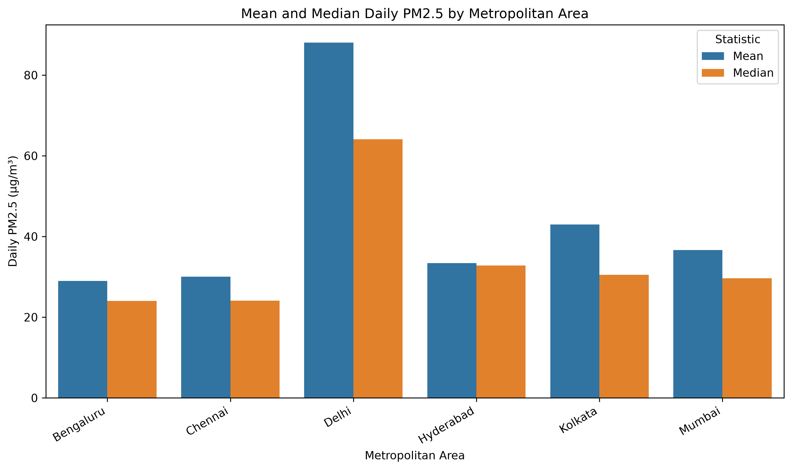
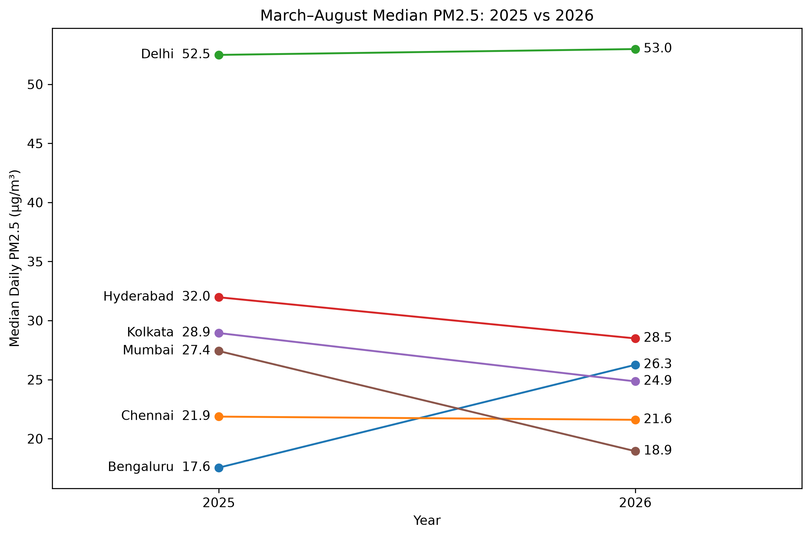

# Statistical Analysis of PM2.5 Air Pollution Across Major Indian Cities

## Overview

This project analyzes PM2.5 air pollution across six major Indian metropolitan areas—Bengaluru, Chennai, Delhi, Hyderabad, Kolkata, and Mumbai—using continuous ambient air-quality monitoring data distributed through the OpenAQ platform and historical data archive (OpenAQ, n.d.). The analysis covers March 1, 2025 through August 31, 2026 and examines differences in PM2.5 concentrations across cities, seasons, monitoring stations, and comparable March–August periods in 2025 and 2026. The objective is to combine descriptive statistics, visualization, and nonparametric hypothesis testing to characterize meaningful differences in urban PM2.5 patterns while accounting for unequal monitoring coverage across cities.

Dataset source: https://openaq.org/

## Dataset Description

The analysis uses PM2.5 measurements distributed through OpenAQ from continuous ambient air-quality monitoring stations in six major Indian metropolitan areas. The underlying primary cohort contained 3,477,273 approximately 15-minute PM2.5 measurements collected from 86 monitoring stations between March 1, 2025 and August 31, 2026. After removing negative measurements and values greater than or equal to 1,000 µg/m³, 3,470,133 valid measurements remained and were aggregated using completeness requirements to produce 34,669 station-day observations. The resulting station-day analysis dataset contains 16 variables, including metropolitan area, monitoring station, local date, mean and median daily PM2.5 concentration, measurement-completeness indicators, year, month, season, day of week, and sensitivity-cohort eligibility. PM2.5 concentration, measured in µg/m³, is the primary numeric variable, while metropolitan area, station, date, and season provide the principal grouping dimensions used in the analysis.

## Methods

The analysis began with systematic data-quality assessment before statistical comparison. Monitoring-station coverage was evaluated across the 18-month study period, and stations were required to report measurements in every analysis month and meet a minimum overall measurement-completeness threshold. This approach follows the broader principle that initial data analysis should examine data quality, missingness, distributions, and longitudinal structure before formal inference (Lusa et al., 2024). The primary cohort used an overall completeness threshold of 60%, while a stricter 70% threshold was retained for sensitivity analysis.

PM2.5 measurements were cleaned by excluding negative concentrations and values greater than or equal to 1,000 µg/m³. Measurements were then aggregated from approximately 15-minute intervals to hourly means, requiring at least three valid measurements per hour, and from hourly observations to station-day means, requiring at least 18 valid hours per day. Descriptive statistics included the mean, median, standard deviation, quartiles, interquartile range, minimum, and maximum. Both means and medians were examined because the observed PM2.5 distributions were right-skewed, allowing the analysis to distinguish typical concentrations from the influence of unusually high-pollution days.

Four visual models were used because each emphasizes a different aspect of the data. City-level boxplots show differences in central tendency, dispersion, skewness, and extreme observations across metropolitan areas. A mean-versus-median bar chart highlights the effect of right-skewed high-concentration observations. A city-by-season heatmap summarizes seasonal differences across metropolitan areas, while a paired-period plot shows the direction and magnitude of differences between March–August 2025 and March–August 2026. Of these, the boxplot provides the strongest single visualization for the primary cross-city question because it represents both typical concentration and variability rather than reducing each city to one summary value.

For the primary inferential analysis, city-level daily PM2.5 values were restricted to dates for which all six metropolitan areas met the required city-level coverage threshold, resulting in a balanced panel of matched dates. Because the same dates were observed across more than two metropolitan areas and the PM2.5 distributions were strongly skewed, a Friedman rank test was used instead of a parametric repeated-measures analysis. The Friedman procedure provides a rank-based approach for comparing multiple related groups without requiring the normality assumption associated with conventional analysis of variance (Friedman, 1937). Dates served as the matched blocks and metropolitan areas as the comparison groups.

After the omnibus Friedman test, pairwise differences between metropolitan areas were evaluated using Wilcoxon signed-rank tests, which provide a nonparametric method for paired comparisons (Wilcoxon, 1945). Because 15 pairwise comparisons were performed, Holm's sequential procedure was applied to adjust for multiple testing and control the family-wise error rate (Holm, 1979). Kendall's W was also reported alongside the Friedman test to describe the magnitude of the overall cross-city effect rather than relying on statistical significance alone.

The matched-date design controls for differences in which calendar dates are represented across metropolitan areas, but it does not explicitly model temporal autocorrelation between successive days. Consequently, the Friedman and Wilcoxon results are interpreted as conventional matched-sample inference rather than time-series inference. Finally, the complete analysis was repeated using the stricter 70%-completeness station cohort and aligned common dates to evaluate whether the main cross-city conclusions were sensitive to monitoring-station selection.

## Results

Descriptive analysis showed substantial differences in daily PM2.5 concentrations across the six metropolitan areas. In the balanced 375-date city panel, Delhi had the highest median daily PM2.5 concentration at 64.11 µg/m³ and the greatest variability, with an interquartile range of 62.02 µg/m³. Bengaluru and Chennai had the lowest medians at 24.04 and 24.13 µg/m³, respectively. As shown in Figure 1, the city-level distributions also reveal pronounced right-skewness and substantial differences in variability, particularly for Delhi.

Figure 2 compares the city-level means and medians. Delhi shows the largest separation between the two measures, with a mean concentration of 88.08 µg/m³ compared with a median of 64.11 µg/m³, illustrating the influence of high-pollution days on the mean.

Seasonal patterns differed across cities. Delhi's median PM2.5 concentration was highest during the post-monsoon period at 200.62 µg/m³ and lowest during the Southwest monsoon at 37.47 µg/m³. Kolkata and Mumbai showed similar patterns, with substantially higher concentrations during winter and post-monsoon periods and lower concentrations during the Southwest monsoon. Figure 3 makes these contrasts especially visible across cities and seasons.

The March–August comparison showed different changes across metropolitan areas between 2025 and 2026 (Figure 4). Mumbai's median concentration decreased from 27.42 to 18.95 µg/m³, a reduction of approximately 30.9%, while Kolkata and Hyderabad also recorded lower medians in 2026. Bengaluru moved in the opposite direction, increasing from 17.55 to 26.26 µg/m³, or approximately 49.6%. Chennai and Delhi changed relatively little. Because the two periods contained different sets of balanced dates, these differences are interpreted as descriptive period-to-period comparisons rather than evidence of long-term trends.

The Friedman test found a statistically significant difference in daily PM2.5 concentrations across the six metropolitan areas, χ²(5) = 767.58, p < .001. Kendall's W was 0.409, indicating a substantial overall cross-city effect. All 15 pairwise Wilcoxon signed-rank comparisons remained statistically significant after Holm correction, although the magnitude of the paired differences varied considerably. Comparisons involving Delhi showed the largest differences, whereas some statistically significant comparisons, such as Hyderabad versus Mumbai, had median paired differences of less than 1 µg/m³.

Within-city analysis also showed meaningful variation among monitoring stations. Delhi had the largest range in station-level median PM2.5 concentrations at 36.91 µg/m³, while Chennai showed the smallest range at 6.73 µg/m³. This indicates that metropolitan averages can conceal substantial spatial variation within some cities.

Sensitivity analysis using the stricter 71-station cohort produced a similar overall cross-city result. On the 356 dates common to both primary and sensitivity analyses, Kendall's W changed only from 0.407 to 0.434. Median estimates were also generally stable across cohorts, although Mumbai's median decreased by approximately 20% under the stricter station-selection criterion, indicating greater sensitivity to monitoring-station composition in that metropolitan area.

## Interpretation for a Non-Technical Audience

The analysis shows that PM2.5 air pollution differs substantially among the six metropolitan areas studied. Delhi consistently experienced higher pollution levels and much greater day-to-day variation than the other cities, while Bengaluru and Chennai generally had the lowest typical concentrations. Seasonal conditions also matter: several cities, especially Delhi, Kolkata, and Mumbai, experienced much higher PM2.5 levels during winter or post-monsoon periods and lower levels during the Southwest monsoon.

The statistical tests confirm that the differences among cities are unlikely to be explained by random variation alone. However, statistical significance does not mean every difference is large enough to be practically important. Some city pairs differed by large amounts, while others showed statistically detectable differences of less than 1 µg/m³. For this reason, the results should be interpreted using both the statistical tests and the actual size of the observed differences.

The comparison between March–August 2025 and March–August 2026 also shows that changes were not uniform across cities. Mumbai, Kolkata, and Hyderabad recorded lower median concentrations in 2026, while Bengaluru recorded a substantial increase. These comparisons describe what occurred during the two observed periods but should not be interpreted as evidence of a long-term improvement or deterioration in air quality.

Finally, pollution levels can vary considerably between monitoring stations within the same metropolitan area. This means that a single city-wide average may not represent the experience of every neighborhood equally. The sensitivity analysis also showed that most conclusions were stable when a stricter monitoring-station selection rule was used, although Mumbai was more affected by which stations were included.

## Limitations and Potential Bias

Several limitations should be considered when interpreting these findings. First, the monitoring network is not spatially uniform across metropolitan areas. The primary cohort contained substantially different numbers of stations per city, ranging from five in Bengaluru to 36 in Delhi. Monitoring stations are therefore not a random or equally distributed sample of each metropolitan area, and city-level summaries may be influenced by where monitoring equipment is located. Aggregating station-level observations to city-day values and repeating the analysis with a stricter station cohort reduces this concern but cannot eliminate spatial representativeness bias.

Second, measurement availability was incomplete. The analysis imposed minimum completeness requirements at the station, hourly, daily, and city-day levels, but missing observations could still introduce bias if missingness is related to pollution conditions rather than occurring randomly. Careful examination of missingness and longitudinal data structure is an important component of initial data analysis because incomplete observations can affect subsequent statistical inference (Lusa et al., 2024).

Third, the study period covers only 18 months and therefore does not contain multiple complete annual cycles. Seasonal differences observed in this dataset should consequently be interpreted as patterns within the study period rather than as long-term climatological relationships. Similarly, the March–August 2025 and March–August 2026 comparison uses the same calendar months but not an identical set of dates. The observed differences therefore describe the available periods and do not establish a long-term trend or causal change in air quality.

Fourth, daily PM2.5 observations may exhibit temporal autocorrelation, meaning adjacent days can be more similar than statistically independent observations. The matched-date Friedman and Wilcoxon procedures account for comparisons among cities on the same dates but do not explicitly model serial dependence across successive dates. Their p-values should therefore be interpreted as conventional matched-sample inference rather than as results from a time-series model.

The upper cleaning threshold of 1,000 µg/m³ was also a project-specific anomaly-screening rule rather than a universal regulatory validity threshold. Rare valid extreme observations could therefore have been excluded, while less obvious anomalous values below the threshold may remain.

Finally, sensitivity analysis showed that Mumbai's estimated median concentration changed materially when the stricter monitoring-station cohort was used, demonstrating that some city-level estimates are sensitive to station composition. More broadly, the city averages reported in this study should not be interpreted as uniform exposure for every neighborhood or as estimates of individual health risk. Doing so would overlook the substantial within-city variation observed among monitoring stations and could overstate what the dataset supports.

## References

Friedman, M. (1937). The use of ranks to avoid the assumption of normality implicit in the analysis of variance. *Journal of the American Statistical Association, 32*(200), 675–701. https://doi.org/10.1080/01621459.1937.10503522

Holm, S. (1979). A simple sequentially rejective multiple test procedure. *Scandinavian Journal of Statistics, 6*(2), 65–70. https://www.jstor.org/stable/4615733

Lusa, L., Proust-Lima, C., Schmidt, C. O., Lee, K. J., le Cessie, S., Baillie, M., Lawrence, F., & Huebner, M. (2024). Initial data analysis for longitudinal studies to build a solid foundation for reproducible analysis. *PLOS ONE, 19*(5), e0295726. https://doi.org/10.1371/journal.pone.0295726

OpenAQ. (n.d.). *Measurements*. OpenAQ Docs. https://docs.openaq.org/resources/measurements

Wilcoxon, F. (1945). Individual comparisons by ranking methods. *Biometrics Bulletin, 1*(6), 80–83. https://doi.org/10.2307/3001968
